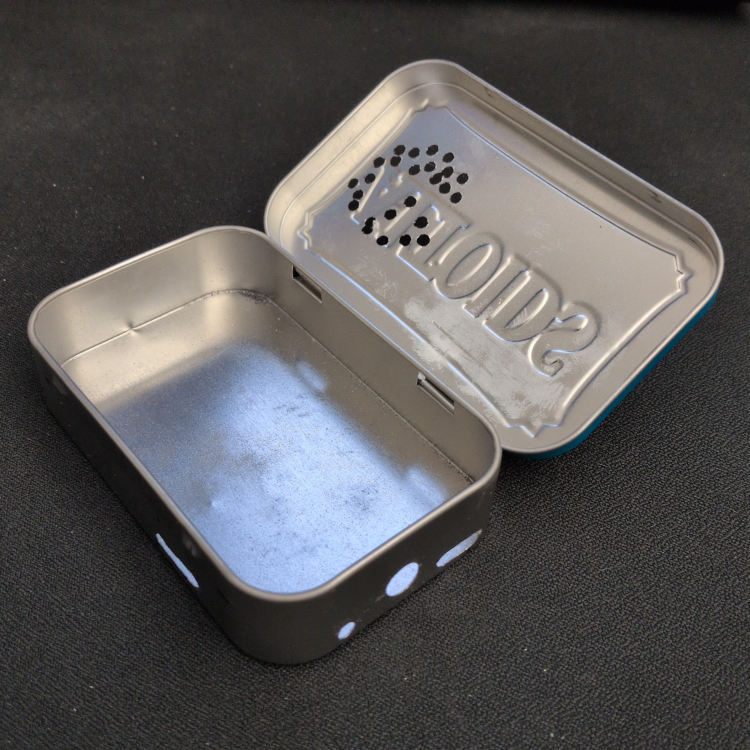
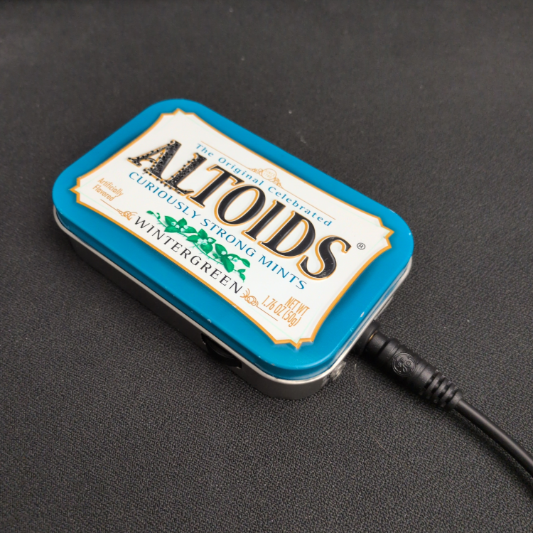
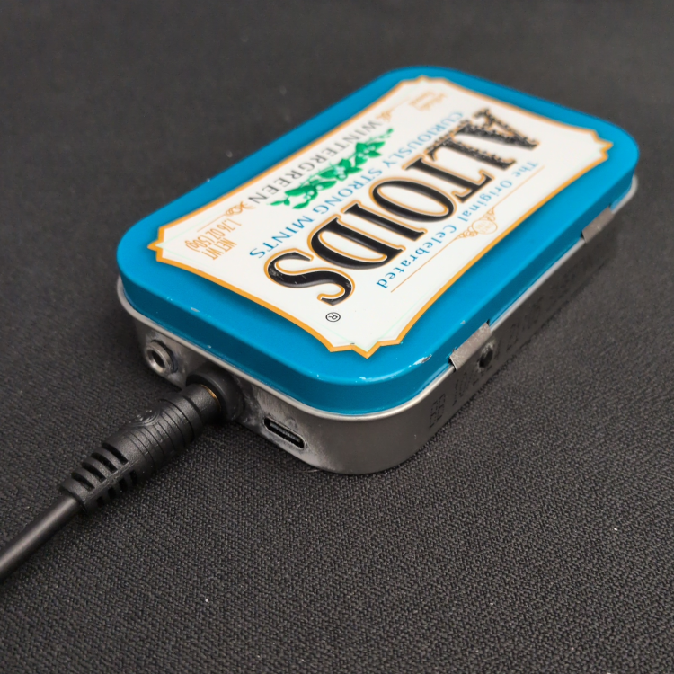
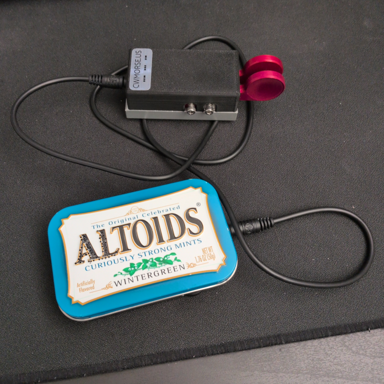
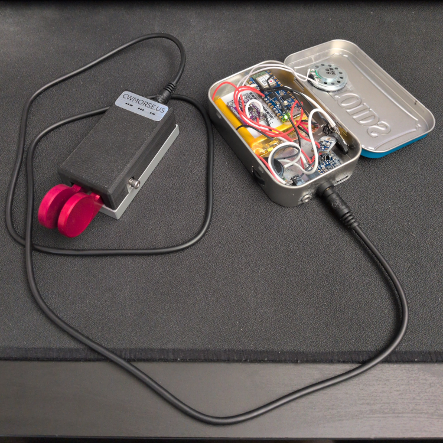
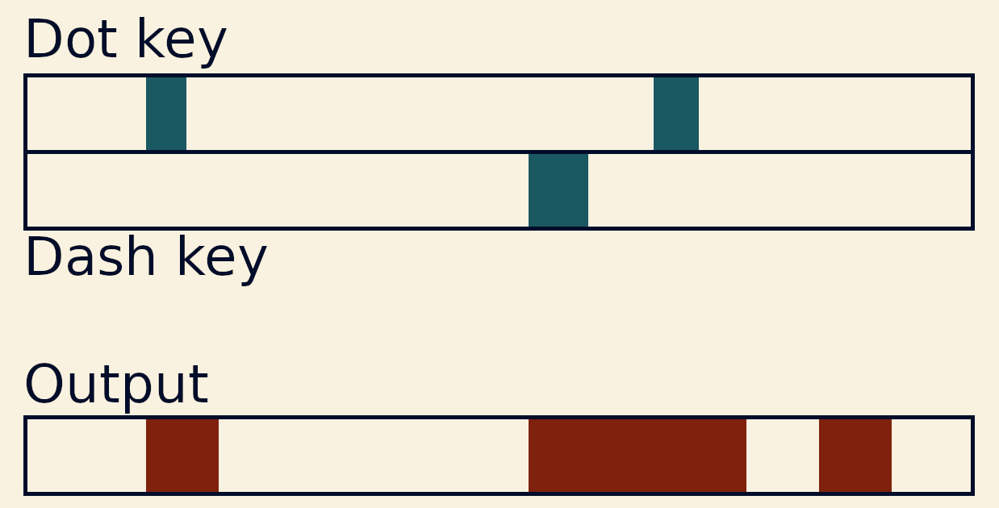
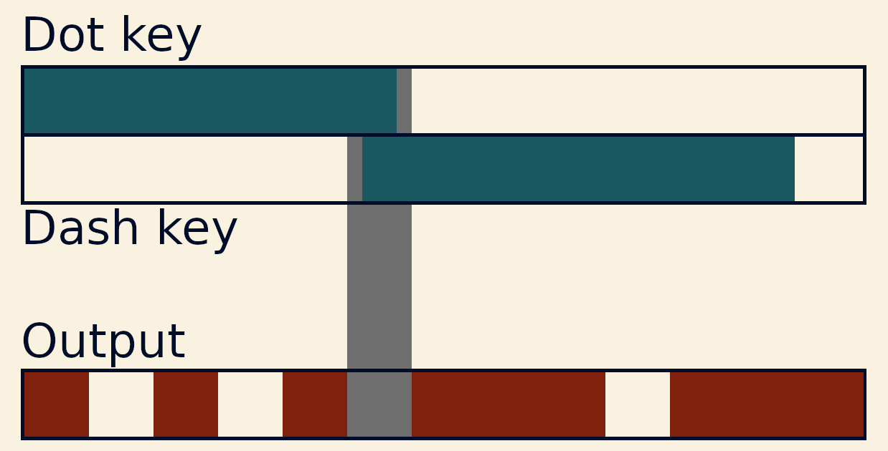
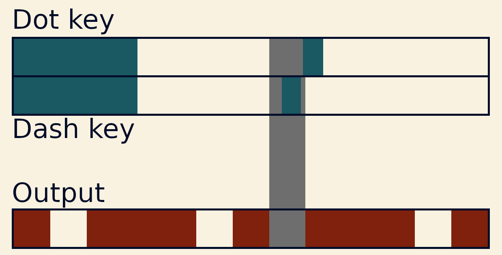
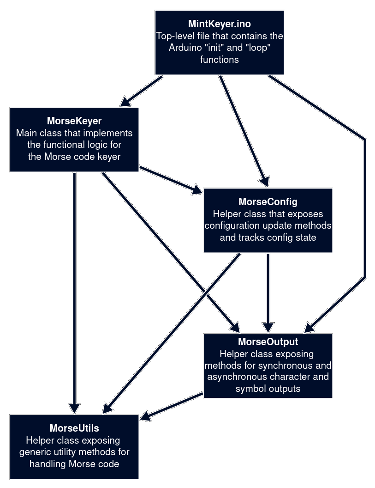

## Morse Code Keyer Project
Keen-eyed readers will know that I'm a Technician-class amateur radio operator. Right now, my goals in this space are to upgrade to General class and to learn Morse code. Morse code (also called Continuous Wave, or CW) had almost entirely fallen out of commercial and military use by the turn of the 21st century, but it remains a pillar of amateur radio. It persists among hams because it's a rewarding art form in and of itself and it can punch through signal-to-noise ratios that would render most other modes unusable.

Traditionally, Morse code was transmitted with a straight key. Electrically, a straight key is just a momentary switch. When you press the key down, the circuit closes, and the transmitter starts sending a tone down the line or through the air. When you release the key, the circuit opens and the tone stops. It's a dead simple setup, and it just works. However, it takes a lot of practice to get all of the timing and spacing just right, as you're in charge of producing all aspects of the code yourself. An amateur can typically only get to around 20 words per minute (WPM) on a straight key.

These days, most CW operators use an automatic or semi-automatic key. The most common automatic setup for modern hams is a key with two paddles connected to the transmitter through an automatic keyer. In this configuration, holding the left paddle causes the keyer to send a string of dots to the transmitter, and holding the right paddle causes the keyer to send dashes. When both are held, the keyer alternates between dots and dashes.

<video controls src="../../images/2026-02-08/k3%20demo.mp4" alt="LogiKey K3 demo"></video>

The paddle key is still just two momentary switches, electrically speaking, but the automatic keyer has to be there to translate the two paddle inputs into Morse code for the transmitter to send out. 

When I was first getting into CW, I bought a Logikey K3 keyer to practice with, but it's pretty clunky. For starters, it requires an external 12V power supply and doesn't have a power switch or volume knob. After thinking about it for a while, I eventually got tired of plugging it in every time I wanted to use it, so I decided to just build my own keyer.

### The requirements
I wanted to build a keyer that did all of the following:
- Supports iambic keying as I'm used to on the K3
- Smaller in size than the K3
- Has a power switch
- Has volume adjustment
- Configurable output speed and tone
- Has an internal battery with USB charging
- Allows me to use headphones or an internal speaker

So, how did I do it?

### Getting started 
The basic idea was that I was going to recreate a subset of the functionality of the Logikey K3 using a modern microcontroller. I disregarded most of the fancier functionality like message memory, as I'm not planning on hooking my keyer up to my radio. Before the turn of the millennium, it was standard to connect an external keyer between your key and your radio, but basically all modern HF radios have keyer functionality built right in. 

Because I'd be dropping a whole bunch of functionality, I also decided (almost immediately) that I'd write my keyer's code from scratch. In theory, I could've pulled the microcontroller out of the K3, found or built some apparatus to dump the EEPROM, trimmed down the logic to exclude the extraneous features, and then reworked what was left. However, hand-decompiling machine code for an obscure mid-80s microcontroller would've been beyond masochistic. I'm a fan of all things ridiculous and impractical, to be sure, but writing the keyer logic from scratch instead of looking for a library was already plenty for me to chew on. 

As for the microcontroller choice, it really came down to what I had to hand. This time around, the StatTrak tsuba prototype (see the Projects page) was our victim. It had been sitting in my bottom desk drawer for years at this point, so I didn't feel too bad about giving its Arduino Nano 33 BLE a new lease on life. The rest of the electronics would either be salvaged from a cheap-o radio I got for five bucks at Goodwill or picked up from Adafruit. 

As for the housing, I went back to Old Reliable, my bottom desk drawer. I found a couple of Altoids tins that I'd neglected to throw out years ago. Perfect. 

### Physical construction 
Before I could start messing around with code, I'd have to make sure everything would actually fit in the tin. I broke out my old Dremel (you can guess where I found that) and got to work drilling holes for everything. My first attempt at cutting hte holes was kind of a disaster, helped in no small part by a change of plans I made early on that meant that the hole for the volume potentiometer had to move. 

Whatever. I made a complete mess of that first tin anyways. The holes in the lid for the speaker were pretty gross. My second tin turned out pretty well, and a test fit looked pretty good, so I went ahead with the software. 

### The software 
From the outset, I knew I'd have to use some form of multi-tasking for this project. This is because I'd need to track and update the state of the program while simultaneously coordinating the audio output. Here are some examples of the main behaviours that the code would have to implement. 

The most basic functionality is that a symbol (either a dot or dash) should sound when you push its paddle. If something's already playing, that symbol should be queued behind whatever is currently playing to ensure that the keyer always generates a coherent stream of Morse code symbols. Below is an illustration of the basic behaviour:

When a paddle is held, that symbol should be repeated. After every symbol, there's a space with the same duration as a dot that allows only the opposite symbol as what was just played to be queued. 

When both keys are held down together, the keyer alternates between a dot and a dash, starting with whichever key was pressed first. 

After looking into the timer interrupts supported by the Arduino's Nordic nRF52840, I determined that the hardware interrupt approach was overkill for this project. Instead, I used a simple pseudo-multitasking approach based on the Arduino library's `millis()` function. When called, that function just returns the number of milliseconds that have passed since the microcontroller was powered on. It may not seem useful at first glance, so here's a simple example of how you use this to create a multitasking-like structure. 

Imagine that you want the Arduino to blink an LED on and off every second while simultaneously sounding a buzzer whenever a button is held down. Start with the naive approach for blinking the LED: 

    void blinkLed() {    
        // Turn the LED on by setting the output pin connected to the LED to the board's 
        // logic voltage (3.3V)
        digitalWrite(LED_PIN, HIGH);

        // Wait for 500 milliseconds, or half a second 
        delay(500); 
        
        // Turn the LED off by setting the output pin connected to the LED to zero volts
        digitalWrite(LED_PIN, LOW);

        // Wait for 500 milliseconds, or half a second 
        delay(500); 
    }

Now imagine that you also have some code that listens to see if your button is being pressed and sets the audio output appropriately: 

    void updateBuzzer() {
        // If the input pin for the button is reading high (meaning the button is pressed)...
        if (digitalRead(BUTTON_INPUT_PIN) == HIGH) {
            // Turn on the buzzer
            digitalWrite(BUZZER_PIN, HIGH);
        } 
        // Otherwise...
        else {
            // Turn off the buzzer
            digitalWrite(BUZZER_PIN, LOW);
        }
    }

If you call either one of these in the `loop()` function of the Arduino code, it will work exactly as expected. However, if you call them both, you'll run into a problem:

    // This function runs over and over as long as the Arduino is powered on.
    void loop() {
        // Enable or disable the buzzer based on whether the button is pressed or not 
        updateBuzzer();

        // Turn the LED on for half a second, then off for a second
        blinkLed();
    }

Do you see it? If you refer back to the definition of `blinkLed()`, that function will have a run time of just over one second due to the two calls to `delay(500)`. While the Arduino is waiting, all code execution is paused. Since we only read the button input and update whether the buzzer is on or off when `updateBuzzer()` runs, the buzzer will only respond to the state of the button once per second. If you push the button and then release it before `updateBuzzer()` runs, nothing will happen. This is because `blinkLed()` is telling the Arduino to kick its heels and do nothing for a full second every time it runs. Here's an implementation of `blinkLed()` that's much more considerate: 

    // We'll need to store some info about the current state of the LED: 
    // Whether the LED is currently on
    bool ledIsOn = true;
    // The timestamp (in terms of milliseconds since the board turned on) of the last 
    // time we flipped the LED 
    unsigned long lastLedFlipTimestamp = 0;

    void blinkLed() {
        // Grab the current timestamp 
        unsigned long currentTimestamp = millis();
        
        // If it's been at least 500 milliseconds since we last flipped the LED state...
        if (currentTimestamp - 500 >= lastLedFlipTimestamp) {
            // Flip the LED state...
            if (ledIsOn) {
                digitalWrite(LED_PIN, LOW);
                ledIsOn = false;
            } else {
                digitalWrite(LED_PIN, HIGH);
                ledIsOn = true;
            }
            // and update the timestamp for when we last flipped the LED to now 
            lastLedFlipTimestamp = currentTimestamp;
        }
    }

Now, the `blinkLed()` function should execute in a fraction of a millisecond. That means we can now put both function calls in `loop()` and get the behaviour we expect!

    // This function runs over and over as long as the Arduino is powered on.
    void loop() {
        // Enable or disable the buzzer based on whether the button is pressed or not 
        updateBuzzer();

        // If it's been at least 500ms since we last flipped the LED, flip it again
        blinkLed();
    }

However, we technically haven't really solved the problem at all. We've just increased the frequency at which we run `updateBuzzer()` from once per second to several thousand times per second. It's still possible to press the button down while `blinkLed()` is running and not get a response, just as before. The difference is that you'd need superhuman speed and precision several times over to this. Top video game speedrunners can hit frame-perfect inputs at 60 frames per second (a window of 16.67ms per frame) somewhat consistently, so you'd have to be at least a hundred times faster than that to notice the problem. Of course, as you make the Arduino do more computational work in `loop()`, the `updateBuzzer()` checks and updates get more and more infrequent:

    void loop() {
        updateBuzzer();

        blinkLed();

        // This takes 250ms to execute! Gross.
        someSlowFunction();
    }

If each run of `loop()` takes 250ms, that's a full quarter of a second of lag and dropped button inputs, which an average person would immediately notice. So, as long as we make sure `loop()` runs at least around 1,000 times per second, it'll feel like the Arduino is doing two things at once. Hence, we have "pseudo-multitasking" -- we can't do true multitasking since we only have one processor core to work with, but this gets us close enough that it makes no odds for this use case. For this application, the very high-level logic is basically the same as the example above: 

    // This function runs over and over as long as the Arduino is powered on.
    void loop() { 
        // Check whether the output needs to change and, if so, update the buzzer state 
        updateBuzzer();

        // Check whether the paddles are pressed and set the keyer state accordingly 
        checkPaddleState();
    }

Of course, there's a bunch of other code for dealing with configuration, formatting the output sound correctly, etc., but that's the basic idea that makes the whole thing work. 

In addition to the main file, the code is broken up into four C++ classes: 

1. `MorseKeyer` handles the logic for the keyer functionality, such as turning on/off the buzzer and maintaining a timer for when the symbol that's currently playing should stop.
2. `MorseConfig` handles everything related to configuration, such as interpreting the user's input, saving their config to the board's flash memory, and providing the output speed and tone to other classes. 
3. `MorseOutput` handles everything related to output, including turning the buzzer on/off for asynchronous symbol output and synchronous output of full characters or character strings. 
4. `MorseUtils` contains general-purpose utility methods for character encoding, decoding, and data conversion. 

The dependency tree forms a DAG as follows: 

[The full source code for this project can be found here](https://github.com/bnlonc/MintKeyer). 

### User interface 

If you look at the case, you'll see openings for the following: 

1. Power/volume knob
2. Key jack
3. Headphone jack
4. USB-C charging port 
5. Side button 

Aside from the paddle itself, I deliberately chose to limit the device to only one button for user input. This is because I wanted the keyer configuration to work like the LogiKey K3, where you send Morse code to issue commands to the keyer. I implemented a very small subset of the K3's functionality: a single button (the side button) controls the config mode, and there are three commands. Sending "S" followed by one or two digits sets the output speed in words per minute. Sending "T" sets the output tone pitch in increments of 10 Hz -- T54 sets it to 540 Hz, for example. Finally, sending "Q" followed by either "S" or "T" allows you to query the speed and tone, respectively, with the keyer sounding out the answer to your query in Morse code. 

### So, how's the finished product? 

First, the basic functionality. When I turn the keyer on, the first thing it does is send "--- -.-" or "OK" so that I know it initialized correctly. You can hear how the dot and dash paddles work, both independently and at the same time. You can also hear that the volume knob changes the output volume. 

<video controls src="../../images/2026-02-08/basic%20demo.mp4" alt="Basic demo"></video>

Next, the configuration. In this first video, I push the config button on the side and get a rising major arpeggio to indicate that the keyer is now listening for a command. First, I send "--.- -" or "QT", to query the current tone pitch. The keyer responds "--... ....- -----" or "740" to tell me that the current output is at 740Hz. A descending major arpeggio indicates that the operation was successful. After that, I enter config mode again and send "T54", which changes the tone pitch to 540Hz. You'll note that the config exit tone changes along with the output tone. I did this just for fun to show that you can derive the pitches of a root note and perfect fifth from a given major third by just multiplying by constant factors. See `MorseOutput.cpp` for details. 

<video controls src="../../images/2026-02-08/tone%20demo.mp4" alt="Tone demo"></video>

Here, I do the same thing for speed. I query for the current speed ("QS") and get "15" as a response, meaning the keyer is currently doing input and output at 15 words per minute. I then give the command "S20" to set the current speed to 20 WPM. 

<video controls src="../../images/2026-02-08/speed%20demo.mp4" alt="Speed demo"></video>

Finally, I demonstrate how you can quickly exit config mode by pushing the config button again, and reset your tone and speed settings to the default by holding the config button down for five seconds: 

<video controls src="../../images/2026-02-08/config%20demo.mp4" alt="Config demo"></video>

### Conclusion 

This was a fun little side project. The finished product is a nice little desk toy if nothing else, and it should have me practicing the code more, if only due to creator bias. If I were to do it again, the first thing I'd change would be the process I used for physical construction. I'd definitely make sure to work more carefully with the CA glue I used to avoid getting that white residue everywhere as it dried. I'd also spend the $15 on a set of Dremel drill bits sooner, as I wasted a good amount of time trying to cut holes in the tins with the grinding bits I already had. 

Ultimately, I think the project was a success, as I was happy enough with it to sell my old keyer to another ham after it was all said and done. 

Stay tuned for the satellite radio project I promised :)