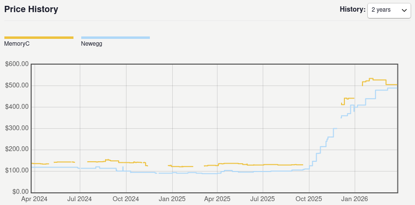
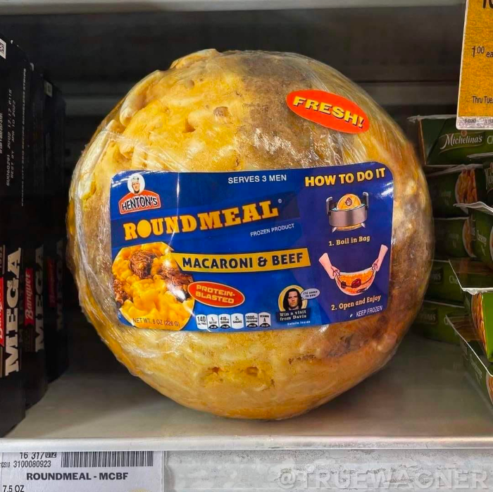

## The Menu
I don't have a ton of time to flesh out every dumb idea that pops into my head these days, which is a real shame, since some of them would make for a pretty funny bit. Here are a few interesting threads I've started pulling on over the last few months that I don't have the bandwidth to fully explore right now. 

## Fear and Loathing in the AI Age 
I read Hunter S. Thompson's superb *Fear and Loathing in Las Vegas* a few months ago. I found myself resonating with Frank Mankiewicz's quip on HST's subsequent entry into the gonzo canon, *Fear and Loathing on the Campaign Trail '72*: it was "the most accurate, and the least factual" account of the 1972 U.S. presidential campaign. Frankly, I don't think today's satirists are sinking their teeth deeply enough into this new paradigm that we're getting dragged into, kicking and screaming. 

Like, come on! How is it that the most mercilessly cutting, off-the-rails critique of American society and politics to date as of March 2026 came out of the *Nixon administration?* Surely we've topped the senseless cruelty of the conscriptions for the Vietnam War by now with immigration policy alone. That's on top of the weekly scandals coming out of DC that would each individually put Watergate to shame. Plus, this is all going on at the very same moment as AI is bursting onto the scene, shaking the technology industry down for its lunch money and turning the economy (and all of our brains) to mush. 

You mean to tell me that all of this is going down at once, but there's not a single crazy person out there who can give us the revival of gonzo journalism that we need now more than ever before? The best we can manage is really some eyebrow wagging from late-night Jimmies on CNN or lame corporate-safe stand-up guys? 

You can't tell me that [this Mother Jones article](https://www.motherjones.com/politics/2025/03/maralago-face-conservative-girl-makeup-brutal-aesthetics-of-maga-trump-gaetz-guilfoyle/) isn't crying out for some Ralph Steadman illustrations.

> *Fear and Loathing in Las Vegas - Illustration by Ralph Steadman*

## Where are all the mobile device KVMs?
Speaking of the tech industry being rendered down into a fine goo: hardware shortages. SSD and DRAM manufacturers are literally selling flash storage and memory faster than they can make it, with hardware being promised to big AI customers months or years before it's physically produced. This has caused a squeeze in the market for us normal people, with RAM prices in particular going completely insane. It has me thinking about an idea I've had kicking around for a while: what if your mobile device did the heavy lifting for all of your personal computing? More plainly, why do I carry both a phone and a laptop around when my phone has enough compute resources to handle 99% of what I do on my laptop?

The KVMs I refer to above are Keyboard, Video, Mouse devices. Basically, think of these things that you see in server farms: 

> *A rack-mount KVM device. It has a monitor, keyboard, and trackpad. This one includes rails that let you slot it into a server cabinet and hook up via serial to directly access the server. Looks like a laptop, but has no processor or operating system of its own.*

Of course, the form factor and protocol would be a little different for a consumer device that stands in for a laptop. It'd probably streamline chassis to look and feel more like a regular laptop, for one thing. A KVM for phones would also do well to replace all those evicted laptop guts with a big battery to let the phone processor really stretch its legs. 

In fact, to my surprise, a few of these consumer-targeting mobile KVMs are already on the market, like the [NexDock](https://nexdock.com/) and the [CrowView Note](https://www.elecrow.com/crowview-note-all-in-one-portable-monitor-phone-to-laptop-device-with-full-featured-type-c-sbcs-mini-pc-pc-game-console-compatibility.html). 

On the phone side of things, this has been supported for years now, and not just on niche OSes like mobile Linux. Samsung phones have had a built-in Desktop eXperience (DeX) since 2017, and Google Pixel and Huawei phones have followed suit. 

So, why are these "lapdocks" still so niche? Especially now, with memory and flash storage getting so expensive, you'd think these things would be everywhere. 

I think the answer is twofold. 

Firstly, I think Chromebooks are the reason these never really caught on to begin with. Chromebooks hit the scene in 2011, long before widespread support for desktop modes on mobile devices. They have more mass appeal, and therefore take advantage of economies of scale to undercut lapdocks in price, even when they're more complex devices. At $229, the NexDock is $45 more expensive than the first few Chromebooks that come up on Amazon. 

Secondly, I think these haven't seen a jump in popularity because we just haven't been in RAM pricing hell long enough for the supply chain to fully feel it yet. 

> *Price over time for the 32GB RAM kit I have in my PC. Note the massive spike starting in October 2025.*

My personal crackpot tech theory: if component prices stay this high long-term, that's going to bump up the price on all personal computers. That bump may open a space in the market that allows the lapdock+phone combo gain some serious traction. I don't think this would be a hard change for most people, so I think adoption is mostly a function of price difference. 

The funny thing is that this is already basically how my team and I use our computers at work. We each have a desk setup with monitors, a keyboard, and a mouse connected to a Thunderbolt dock. When we get to the office, we connect one Thunderbolt cable to our laptops and get charging, displays, and perhiperals all in one shot. 

## The Round Meal
For dessert, something completely orthogonal to all this tech stuff. 

You may have seen this image floating around: 

> *ROUND MEAL. SERVES THREE MEN.*

I'm a big fan of this image, even though it's super fake. As far as I know, nobody's ever actually made one of these in real life. However, I do have a mac and cheese recipe that cools and hardens to a pretty firm end product, so it's definitely something I could pull off. The only problems are: 

#### Round

I'd need some kind of food-safe mould to make the meal set into a round shape. I'd either have to make a cast using a basketball or have something 3D printed. The mould would have to be resilient enough to heat to withstand the temperature of the fresh mac and cheese coming out of the oven without deforming or leaching chemicals of some kind. 

#### Meal

I'd need a way to wrap the thing and make it re-heatable. Ideally, I'd make it accurate to the "boil in bag" statement from the original image. I'd need some way to wrap the thing in a form-fitting bag that can withstand being boiled while remaining watertight and not leaching out anything weird. I honestly don't know where I'd even start on that front. 

If you're smart enough to come up with solutions to these problems, email me (see the "Home" page) for the recipe. 