I’ve been subscribed to local Seattle YouTuber Wrsitwatch Revival for quite a while. I’m a watch collector, so I obviously like seeing the various odds and ends that cross his bench, but I also really like to watch him work through and iterate on his process for bringing old watches back to life.  Since he's a hobbyist without formal training, it's similar to how you or I would learn for ourselves. His storytelling and production style are also just pleasant. [I highly recommend that you check his channel out.](https://www.youtube.com/@WristwatchRevival)

He encourages his audience to get into watch restoration as well, which seems really cool to me, but I don’t think it’s something I’ll ever get around to. I’m sort of a take-stuff-apart-and-put-it-back-together guy, but I don’t think I have the fine motor skills for that scale of work. It takes a bunch of practice and specialized (read: expensive) tools to do properly, and I don't think I'm prepared to dive into that world. I’m happy to let Marshall buy all the tools and repair pieces and go along for the ride on his channel.

More recently, I’ve also taken an interest in portable cassette players, like Sony Walkmans (Walkmen?) and their competitors. I think they’re interesting for the same reasons that watches are interesting: they’re simultaneously fine works of engineering and expressions of style. Physically, they're somewhat similar: both are portable mechanical devices that use a simple physical principal to make something useful happen. A watch has a mainspring that sends torque through a series of gears to the escapement, which regulates the discharge of that torque to drive the hands at the right speed. A cassette player uses a regulated motor to drive a series of gears and levers to run the surface of a tape over a head at the right speed. The regulation happens at opposite ends of the mechanisms, but the concepts are very similar. The physical principals at the "business ends" of the mechanisms are also similar in that they're conceptually simple, whether they're a pendulum or a magnet.

Of course, simple doesn’t mean easy in either of these cases. The ultimate goal for both is to move the "business end" of the mechanism both accurately and consistently. That is, for ideal operation, you need both the average speed to be as close to the design spec as possible, and the average variance in speed due to orientation, temperature, etc. to be as close to zero as possible. Tolerances are on the order of 1% for Walkman average speed, 0.3% for Walkman speed variance, and 0.1% for the average speed and variance of a mechanical watch. This (I assume) is a total pain in the ass if you’re an engineer trying to design these not only to work reliably, but also to be cost-effective, mass-producible, and maintainable. For those of us who like to tinker with obsolete technology, though, it means we get some pretty ingenious mechanisms to sink our teeth into.

With all that said, I decided that I’d get my hands on a broken Walkman and try my hand at fixing it. My opportunity came when I went to a local electronics recycling shop, RE:PC, and sifted through their audio player bins. In among a whole bunch of radios, Discmans, and Walkmans that had been beaten up to high hell, I found an Aiwa HS-J470 in remarkable condition for just $30. It's not a "true" Walkman, as that's a Sony trademark, but the idea is the same. There were no remarks about the tape mechanism, but it was stated that the player would only make a loud squealing sound, regardless of whether it was set to play the tape or the radio.

I think it was priced so low because everything, even the radio, was broken. Usually, a Walkman dies because the belt in the tape mechanism turns to goo or disintegrates. This leaves the radio working, which you can use to show that it's just the one part that went bad. In this case, it was something wrong with the electronics, which meant that the soldering-shy needed not apply. Of course, being handy at soldering wouldn't help if it was one of the ICs or some other hard-to-replace part had died. Buying it meant betting on a few things:

1. I'd be able to replace whatever electronic component had died.
2. The main failure wasn't concealing some secondary issue that I wouldn't be able to repair.
3. The mechanism wasn't totally borked.

In the end, after looking it over, I decided to take my chances.

## Diagnosis

#### First impressions

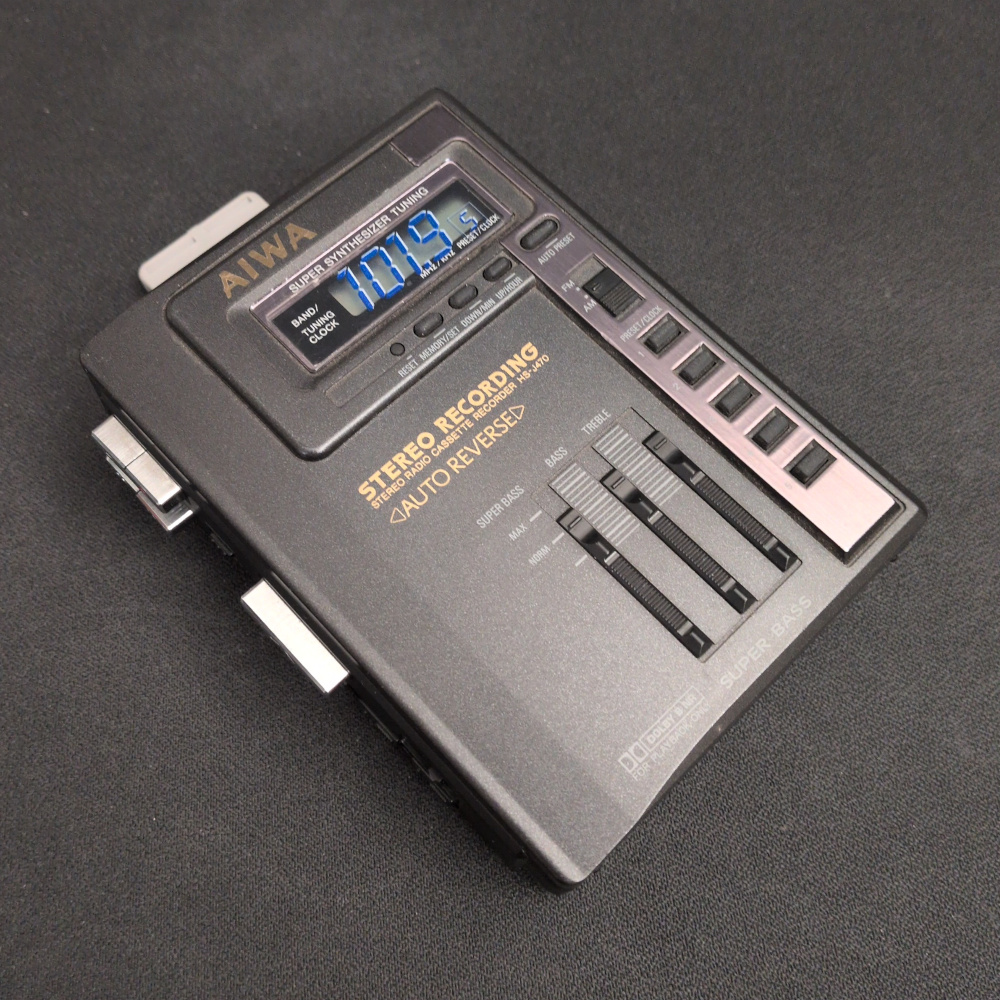

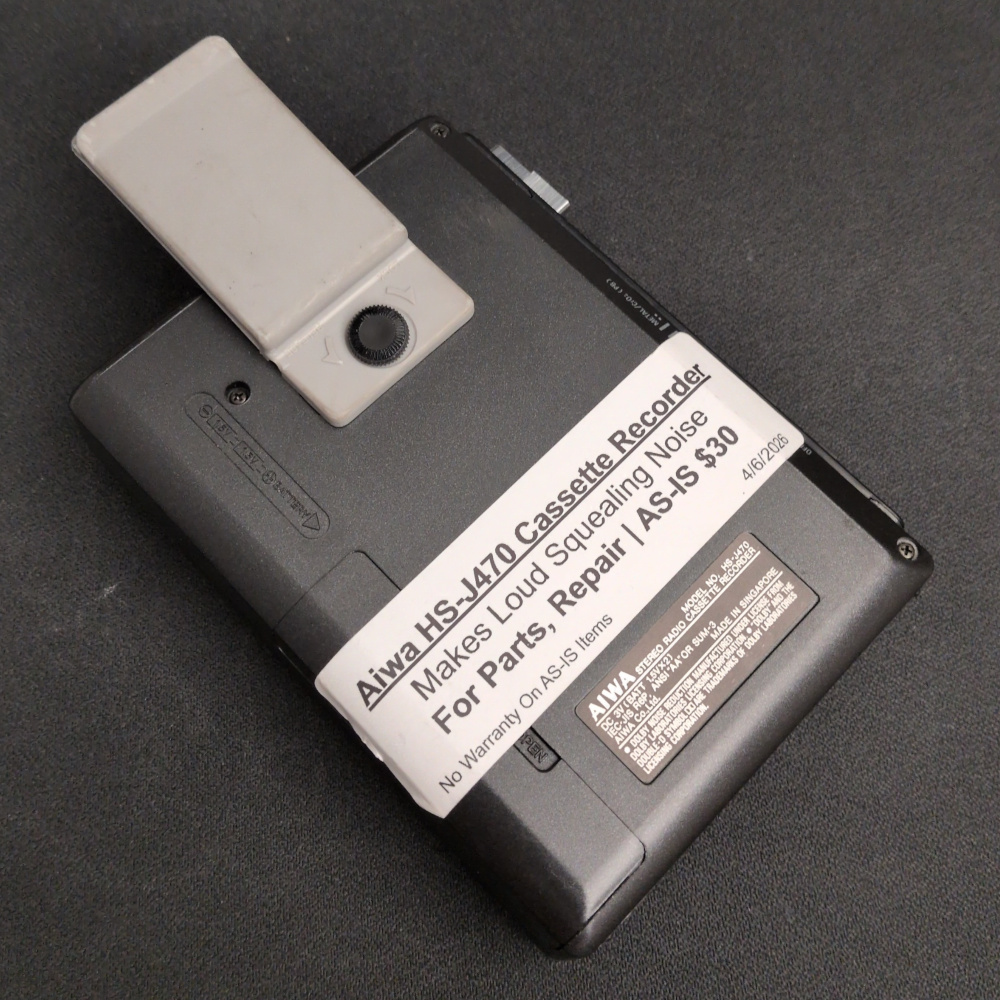

Once I got it home, I peeled off the very annoyingly sticky label and loaded up some batteries.

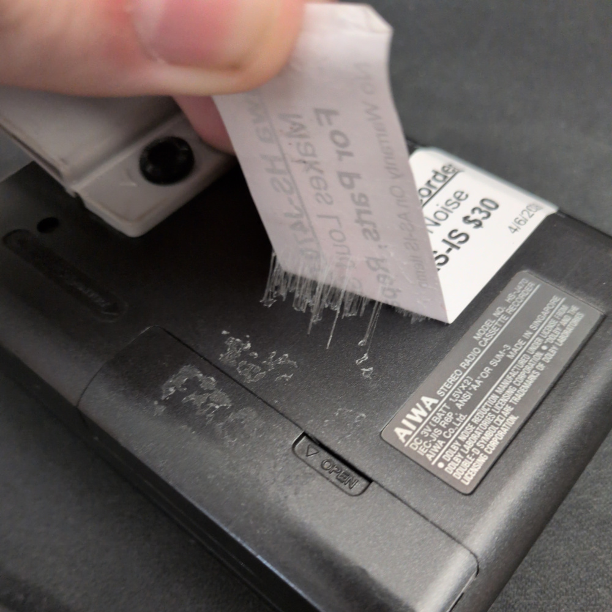

My designated test subject for unknown or suspicious players that I suspect may destroy tapes is He Touched Me (a gospel tape, naturally) that I got brand new at Goodwill for 49 cents.

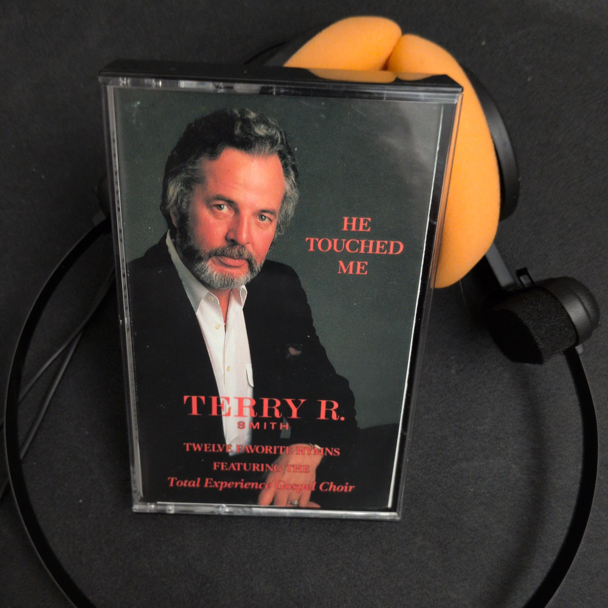

First, the bad news: when I started it up, I confirmed what that groaty label said: a horrible screech came out of the headphone port when I played AM radio, FM radio, or the tape, no matter what settings I used.

I also discovered some good news, though: after running the tape for a bit, I didn’t hear any cracking, creaking, or grinding, and I heard the motor running as expected. When I pulled the tape out, it was advanced a little ways as expected with no unspooling or damage. As far as I could tell, the mechanical tape transport was working exactly as it should.

<video controls src="../../images/2026-07-06/tapeSqueal.webm" alt="Tape squeal" class="noRadius"></video>

<video controls src="../../images/2026-07-06/radioSqueal.webm" alt="Radio squeal" class="noRadius"></video>

#### Taking a deeper look

I started by taking off the back and inspecting the internals. A few things stood out to me immediately.

Firstly, I noticed a big fingerprint smudge on the copper ground plane. Apparently, I had inherited someone else's project. This was bad news, as it meant I couldn't be sure whether anything inside would be factory-original or modified by my predecessor.

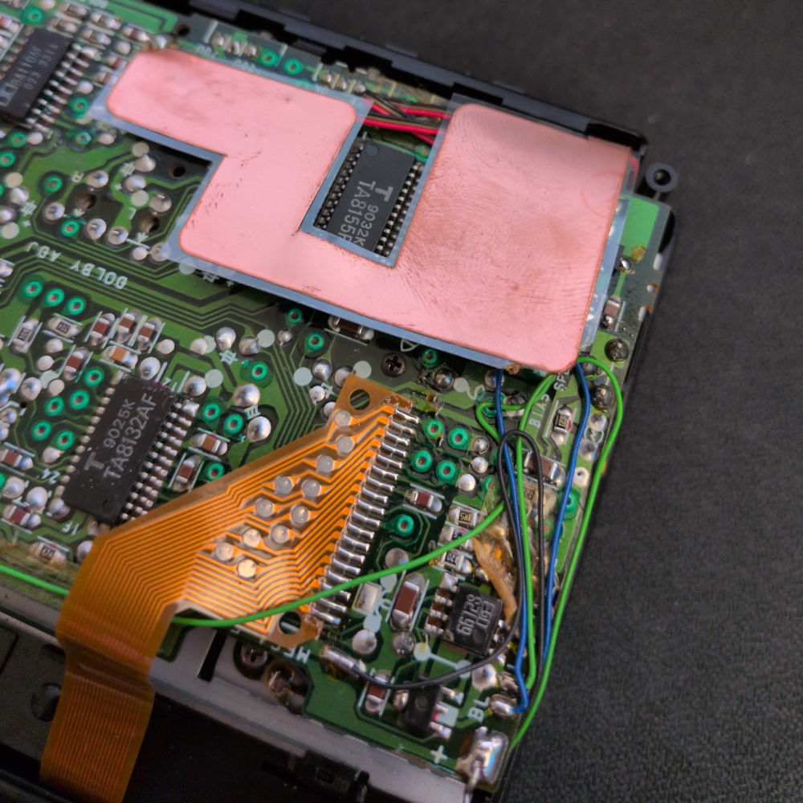

Next, I turned over the PCB to inspect the top side, where all the capacitors are. While the most common failure mode for a Walkman is the belt going bad, the runner-up is definitely bad capacitors. When I first looked around, I was a little dismayed to find nothing obviously wrong, but I discovered two anomalies when I looked more closely at the photo I took. Can you spot them?

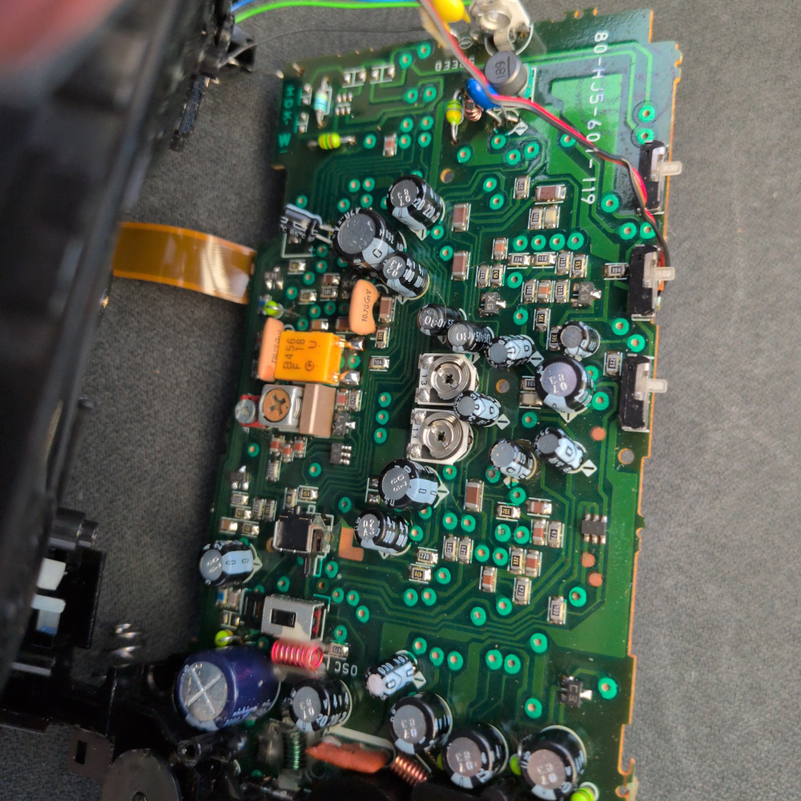

Firstly, just below and to the right of the middle of the board: see that orange residue? That's dried capacitor electrolyte, AKA dead capacitor guts. This indicates that this capacitor has leaked and totally failed. Since the capacitor can no longer hold a charge or filter out low-frequency signals, the circuit isn’t going to behave as intended. This is almost certainly what’s mangling the audio output.

Secondly, at the top of the board: do you see that blue tantalum capacitor? Look below it, where its legs pass through the board. That circular marking seems to indicate where an electrolytic capacitor should go. This looks like it’s been replaced by our mystery predecessor. If this cap is in the audio signal path, I’ll want to replace it because tantalum capacitors have undesireable distortion characteristics. The service manual for this unit isn’t available online, though, and I wouldn't trust myself to interpret a schematic to figure out if it’s in the signal path anyways. Just to be safe, I’m going to replace it and all the other electrolytic capacitors on the board.

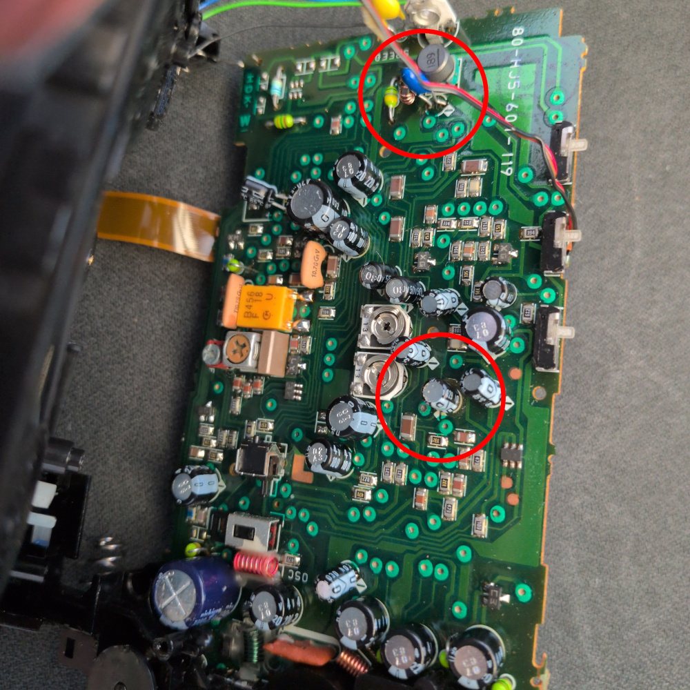

#### Checking the mechanical side

While we seem to have found the root cause of this Walkman’s failure, we should still take a look at the mechanical parts to see if we find anything out of place.

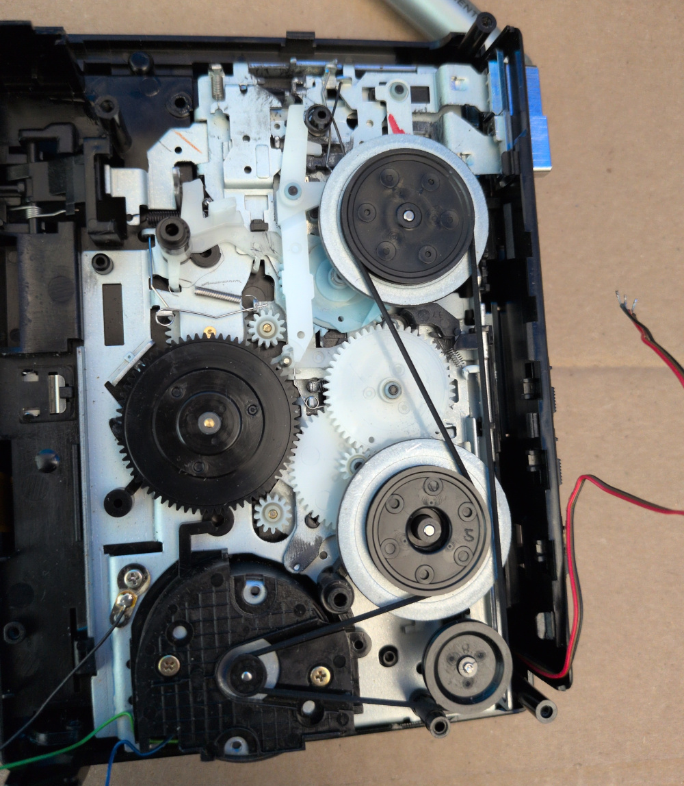

Amazingly, everything seems to be in order. Even the belt looks like it’s in good shape, though I can’t be sure if that part is original or was also replaced when the tantalum cap was installed. Just to be on the safe side again, I’m also going to replace the belt.

#### The plan

Here’s the docket for this repair:

1. Replace all the capacitors on the board
2. Replace the belt
3. Clean up any residual crap and old lubricant I can access with 99% isopropyl alcohol
4. Apply oil to the metal-metal contact points in the mechanism and the capstan and motor bearings
5. Apply grease to the plastic-metal and plastic-plastic contact points and gears in the mechanism
6. Adjust the speed and azimuth

#### The shopping list

1. New caps. Luckily, I found [a Reddit post about re-capping this exact model](https://www.reddit.com/r/cassetteculture/comments/1m3s7ay/aiwa_hsj470_capacitors/), which had a diagram that showed the capacitance, voltage rating, and size of every cap on the board. Following the advice on fixyouraudio.com, I looked for aluminum polymer caps first, and then looked for electrolytic capacitors when polymers weren’t available. I ended up finding everything at Mouser.
2. A new belt, from fixyouraudio.com.
3. 99% IPA.
4. Following the advice of a few forums, I got some watch oil for metal-metal contacts from a watchmaker's supply house.
5. Following the advice of those same forums, I used Super Lube multi-purpose synthetic grease. I actually already had a tube of this that I used for lubricating the stabilizers on a custom keyboard build.
6. A 3kHz reference tape, also from fixyouraudio.com.

## Repair

I started with the capacitors, as those arrived first. Before I removed any of them, I tested them with an LCR meter in situ to see if the one I expected to be dead was actually dead and to check for any other failures. This would also help to illustrate why measuring a component while it’s attached to a circuit can give you bad results. After I removed the capacitors, I tested them again to get a more reliable capacitance measurement. Here are the results:

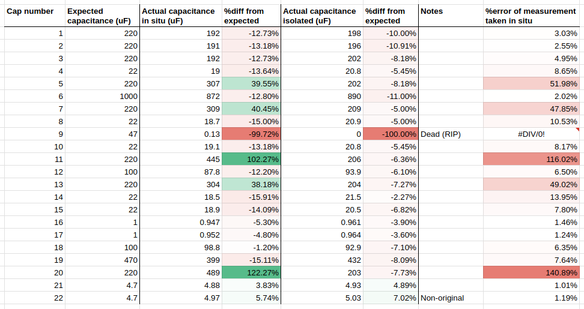

As you can see, capacitor 9 (the one with electrolyte all over it) was indeed dead. RIP. Capacitor 22 (the tantalum one) did turn out to have the right capacitance, but it was only rated for about half the voltage it should’ve been rated for. Yikes! That's particularly concerning because tantalum caps are known to fail closed. This means they can become conductors upon failure and send unintended current to other parts of the circuit, frying other components.

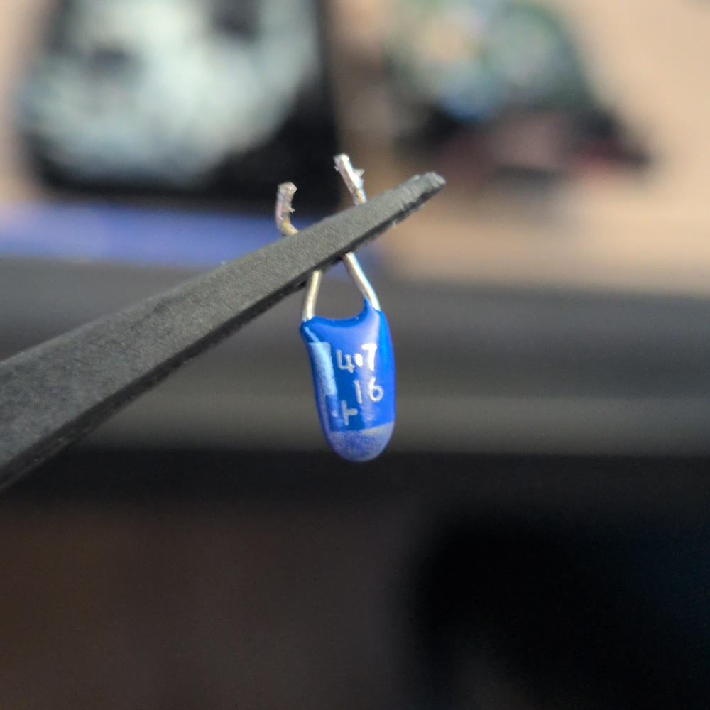

I marked all the old caps with a Sharpie…

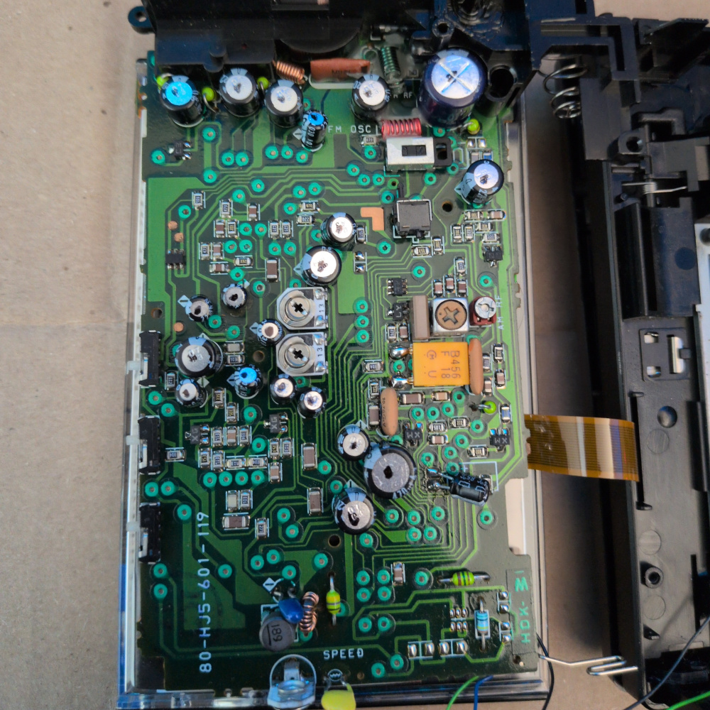

and then replaced them all with the new ones.

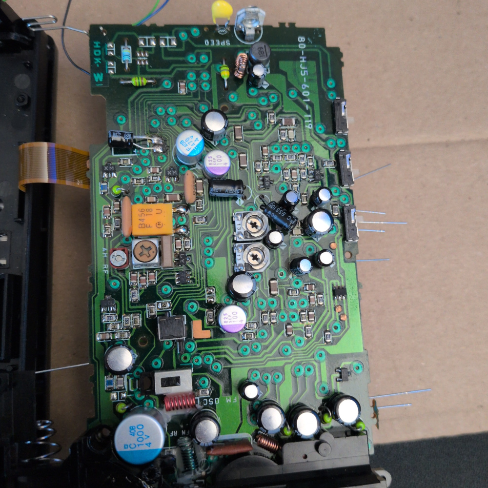

I managed to get polymer caps (the silver cans) for some of the replacements, but the rest were only available as electrolytics. All the caps were short enough to not interfere with the mechanism except for the 1uF 50V ones, for which I couldn't find sufficiently short replacements. To cope with this, I left their legs a little long and bent them so that they would lay flat on the board.

After that was done, I tested the radio and heard music coming through properly! This was a great sign, as it meant there weren’t any other issues lurking around in the electronics.

Next, I got to work on preventative maintenance for the mechanical parts. I used the ends of Q-tips soaked in the 99% IPA to clean up the mechanism, and then I used a Q-tip cut at an angle to apply the grease and oil. I also applied some oil to the motor spindle and the capstan bearings. I wasn’t able to actually get the capstan bearing covers off, but I could lift them up just enough to get the point of the cut Q-tip underneath.

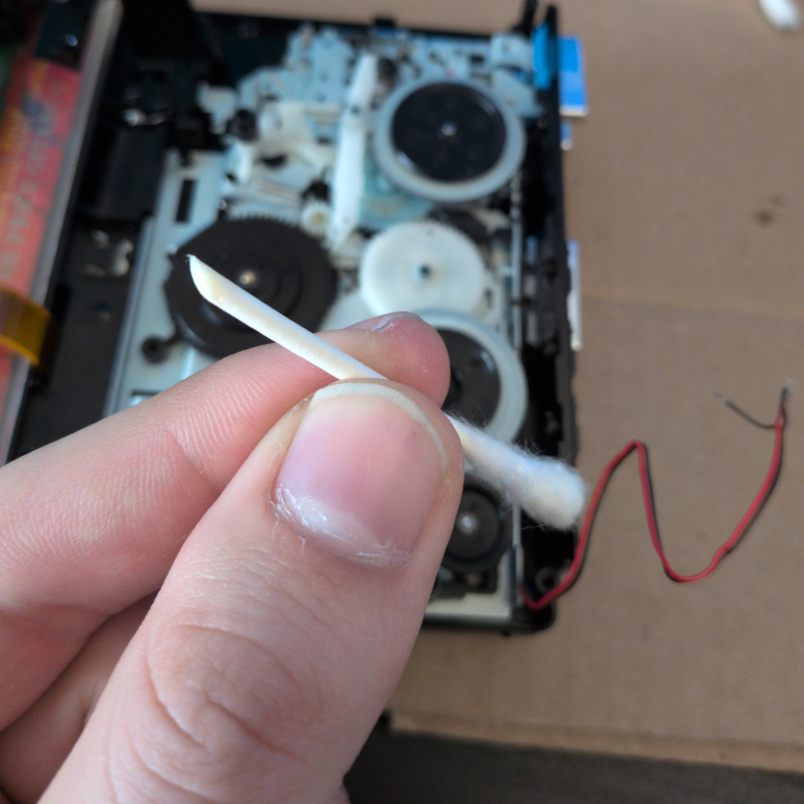

Finally, I installed the new belt and started putting the player back together. I encountered an issue where one of the flywheels started rubbing up against a capacitor when I started to close everything up, but I was able to reach in and gently bend it out of the way. Once the mechanism was moving smoothly again, I used the speed reference tape to adjust it. After it was all put back together, I followed [VWestlife's advice](https://www.youtube.com/watch?v=zFUp5JRwQUw) for adjusting the azimuth by ear using a pre-recorded tape that includes applause. I may come back to this later once I have my Sony TC-K71 cassette deck back from being serviced, as I'll be able to use it to record a 15kHz tone on the the other side of the 3kHz reference tape. This will give me a more accurate reference for dialling in the azimuth.

## Results

After everything was done, I was happy with how the player sounded. I measured the wow and flutter using WFGUI, and I got a W&F figure around 0.45%. While that’s not great, it’s not terrible either. Definitely listenable in my opinion. 

I also have a “properly” restored Sony WM-AF57, which I tested in the same way for comparison. While the Sony showed a W&F figure of just over 0.3%, I also managed to capture in data something that I'd known anecdotally for a while: the Sony's playback speed varies drastically based on its physical orientation. It's bad enough that you can actually hear the speed waver back and forth if you move in the right way while it's in your pocket or attached to your belt. Across the three positions I tested, the Sony measured an average standard deviation of speed of 20.82Hz, while the Aiwa measured in at 6.79Hz. This means that the Sony will sound better while stationary and playing in one of the positions and directions where its speed is relatively close to true. By contrast, the Aiwa will sound better when you're actually Walking your Man. lol.

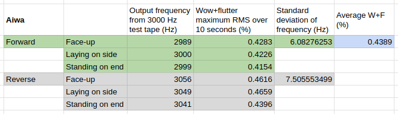

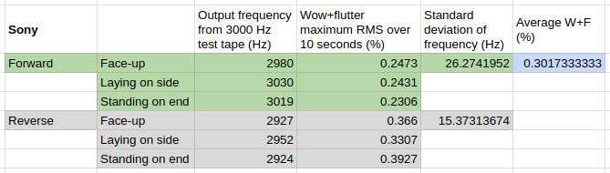

I was definitely very happy to be done with this project, and all that’s left is to decide whether I want to keep this Walkman to enjoy myself or sell it on to make room for more projects.

<video controls src="../../images/2026-07-06/tapeWorking.webm" alt="Tape working" class="noRadius"></video>

#### Lessons learned

This project definitely didn’t go 100% smoothly. I had quite a few hang-ups, including not having access to a service manual and not being able to get the capstan bearing covers off. However, neither of those turned out to be dealbreakers. While the wow and flutter after the repair isn’t terrible, I was hoping for something closer to the 0.25% to 0.3% range. If I were to start the restoration again, I would’ve also replaced the pinch rollers. While they weren’t particularly degraded, they’re also rubber parts that are decades old. If that wow and flutter is hiding anywhere, my guess is that it’s with those.